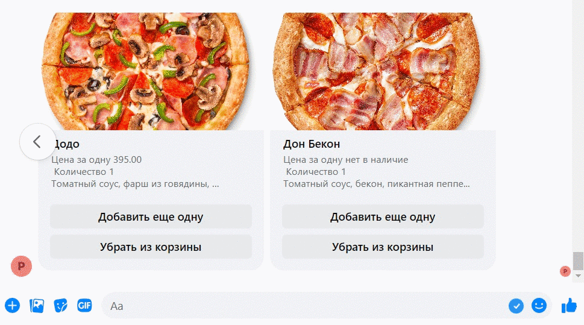

# Телеграм-бот и фейсбук бот пиццерии

Это бот, привязанный к магазину на платформе [elasticpat](hhttps://euwest.cm.elasticpath.com/account).
Бот предлагает меню продуктов, можно добавить/удалить продукты в корзину.
Бот запросит ваш адрес и расчитает расстояние до ближайшей пицеррии, предложит 
самовывоз или доставку. При выборе доставки или самовывоза расчитает стоимость 
заказа с доставкой и предложит оплатить. Бот привязан к платежному терминалу ЮКасса.
После оплаты курьеру отошлется сообщение с адресом доставки.

Бота можно запускать на фейсбук. Бот предлагает меню продуктов, можно добавить продукты в корзину, работать с корзиной.

## Пример работы бота:
ТГ бот


ФБ бот


## Запуск:

### 1. Копируем содержимое проекта себе в рабочую директорию
```
git clone <метод копирования>
```
У вас будет 5 функциональных файла:
- pizza_bot.py - этот главный файл для работы с ТГ ботом
- moltin.py - это вспомогательный файл с функциями для обращения 
к базе данных магазина на платформе elasticpat
- create_db.py - это файл, в котором создавалась база данных с продуктами
на платформе elasticpat. Запуск функций в файле закомичен, если нужно конкретное действие
  (описано в функции), просто раскомить нужную функцию и запусти файл. Будет создана либо новая модель
либо объекты созданной модели.
- distance_payment.py - это вспомогательный файл, где собраны функции расчета расстояния
установки таймера и совершение оплаты
- webhook_facebook.py - этот главный файл для работы со страницей Фейсбук

### 2. Устанавливаем библиотеки:
```
pip install -r requirements.txt
```

### 3. Для хранения переменных окружения создаем файл .env:
```
touch .env
```
Для тестирования телеграм-бота добавляем токен в `.env` файл: `TG_BOT_TOKEN='токен вашего бота'`

После регистрации на [elasticpat](hhttps://euwest.cm.elasticpath.com/account) 
необходимо [авторизоваться](https://documentation.elasticpath.com/commerce-cloud/docs/api/basics/authentication/index.html)
и получить ключи, которые записываем в .env:
```pycon
CLIENT_SECRET='....'
CLIENT_ID='.....'
STORE_ID='....'
```
После создания вашего магазина на [elasticpat](hhttps://euwest.cm.elasticpath.com/account) 
необходимо создать прайс-лист и его ид записать в .env:
```pycon
PRICE_LIST_ID='71b86c9e-cc52-4934-9f3f-7......'
```

Для запуска страницы на фейсбуке с магазином доставки пицц необходимо
создать в магазине на [elasticpat](hhttps://euwest.cm.elasticpath.com/account) 
иерархие продуктов и в ней создать категории (узлы), по которым распределить
продукты. Создать узел продуктов ("основной"), в котором будут продукты,
показанные на главном меню магазина и записать ид иерархие и узла в .env
 Туда же записываем ид других узлов/группировок продуктов:
```pycon
HIERARCHY_ID='5644aa5d-cf68-4dde-9fe0-3eb2c611...'
NODE_ID_BASIC='b41d0763-08db-48a5-913a-a35999....'
NODE_ID_HOT='86028403-e62b-4992-b39f-d0e08....'
NODE_ID_HEARTY='d3e32c20-3269-475f-85ee-d97c....'
NODE_ID_SPETIAL='53911d3a-0e99-4905-bdb9-3f9bc1...'

```

Для работы `redis`, в .env записываем:
```pycon
DATABASE_PASSWORD=''
DATABASE_HOST='localhost'
DATABASE_PORT=6379
```

Для работы с картами и вычисления расстояния нужно зарегистрироваться 
[Yandex geocoder API](https://dvmn.org/encyclopedia/api-docs/yandex-geocoder-api/)
и записать `API_YANDEX_KEY` в .env:
```pycon
API_YANDEX_KEY='1875d767-85e5-47b7-862c-899bcd.....'
```

Для работы с платежной системой нужно в Меню Payments у BotFather нажать /mybots, выбрать бота, и нажать Payments
выбрать ЮКассу и тестовый токен, который записываем в .env:
```pycon
PAYMENT_UKASSA_TOKEN='381764678:TEST:5....4'
```

### 4. Создаем магазин с товарами
на сайте `elasticpat`:
https://euwest.cm.elasticpath.com/products

или с помощью файла `create_db.py`

### 5. Запуск

Для запуска бота нужно запустить `redis` на компьютере в Ubuntu:
```pycon
$ sudo apt upgrade
$ sudo apt upgrade
$ sudo apt install redis-server
$ redis-server
```

### 5. Запуск Фейсбук

Для запуска бота на фб необходимо:
- [получить токен на ФБ](https://dvmn.org/encyclopedia/api-docs/how-to-get-facebook-api/)
и записать его в .env
```pycon
PAGE_ACCESS_TOKEN='fONtVKzJt7BahFLZAhpYfPQbkFc8csJrgZD'
```
- перевести свой локальный компьютер в [https](https://dvmn.org/encyclopedia/web-server/ngrok/)
- подключить [вебхук к фейсбуку](https://dvmn.org/encyclopedia/api-docs/how-to-get-facebook-api/)
в .env и при подключении вебхука должен быть одинаковый `VERIFY_TOKEN`
```pycon
VERIFY_TOKEN=12345
```
- Подключить подписку на postbacks
- В настройках «Редактировать подписки на Страницу» галочку на messages чтобы вебхук отрабатывал сообщение и messaging_postbacks для реакции на кнопки

## Цели проекта

Код написан в учебных целях — это урок в курсе по Python и веб-разработке на сайте [Devman](https://dvmn.org).
